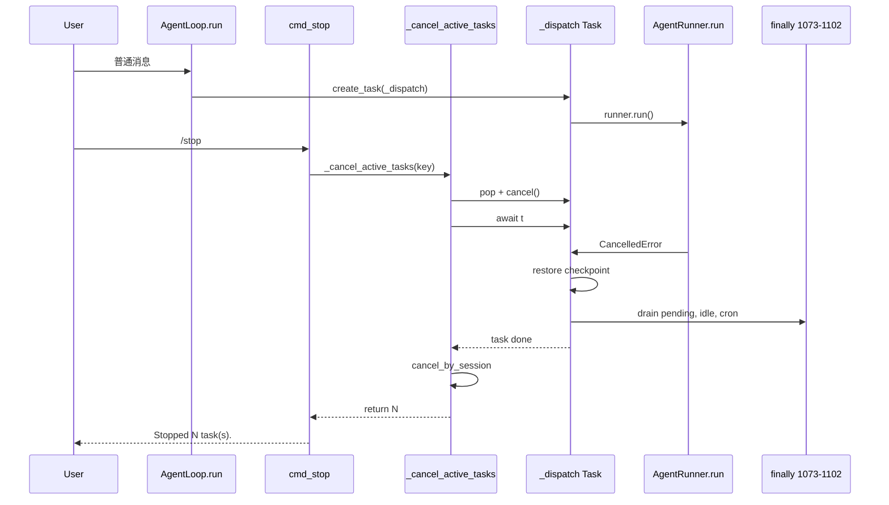

# nanobot `/stop`、`/new` 与任务取消机制深度解析

> 基于 `nanobot/agent/loop.py`、`nanobot/agent/runner.py`、`nanobot/command/builtin.py`、`nanobot/agent/subagent.py` 源码分析。
>
> 本文整理自对「任务取消、asyncio CancelledError、pending queue 清理」等话题的源码走读。

---

## 1. 总览

nanobot 的主消息循环 `AgentLoop.run()` 采用 **异步 task 派发**：每条 inbound 消息 `create_task(_dispatch(msg))`，主循环本身不阻塞，从而能在 agent 执行 LLM/工具循环的中途响应 **`/stop`** 等 priority 命令。

| 命令 | 入口 | 核心行为 |
|------|------|----------|
| `/stop` | `cmd_stop` | 取消当前 session 所有活跃 dispatch task + subagent，回复 `Stopped N task(s).` |
| `/new` | `cmd_new` | 先 `_cancel_active_tasks`，再 `session.clear()` 开新会话 |

两者都调用同一个底层方法：`AgentLoop._cancel_active_tasks(key)`。

---

## 2. 命令入口

### 2.1 `/stop`

```python
# nanobot/command/builtin.py
async def cmd_stop(ctx: CommandContext) -> OutboundMessage:
    total = await loop._cancel_active_tasks(ctx.key)
    content = f"Stopped {total} task(s)." if total else "No active task to stop."
```

- `/stop` 是 **priority 命令**，在 `AgentLoop.run()` 里走 `_dispatch_command_inline`，**不排队、不注入**，立即执行。
- `ctx.key` 即 session key（如 `cli:direct`、`telegram:12345`）；须与 task 注册时用的 **effective session key** 一致（unified session 时为 `UNIFIED_SESSION_KEY`）。

### 2.2 `/new`

```python
# nanobot/command/builtin.py
async def cmd_new(ctx: CommandContext) -> OutboundMessage:
    await loop._cancel_active_tasks(ctx.key)
    session = ctx.session or loop.sessions.get_or_create(ctx.key)
    snapshot = session.messages[session.last_consolidated:]
    session.clear()
    loop.sessions.save(session)
    loop.sessions.invalidate(session.key)
    if snapshot:
        loop._schedule_background(loop.consolidator.archive(snapshot, session_key=ctx.key))
    return OutboundMessage(..., content="New session started.")
```

在 cancel 之外额外做：

1. 清空 session 消息历史
2. 持久化并 invalidate 缓存
3. 后台 archive 未 consolidate 的快照

---

## 3. 核心：`_cancel_active_tasks`

**位置**：`nanobot/agent/loop.py:649-660`

```python
async def _cancel_active_tasks(self, key: str) -> int:
    tasks = self._active_tasks.pop(key, [])
    cancelled = sum(1 for t in tasks if not t.done() and t.cancel())
    for t in tasks:
        with suppress(asyncio.CancelledError, Exception):
            await t
    sub_cancelled = await self.subagents.cancel_by_session(key)
    return cancelled + sub_cancelled
```

### 3.1 四步语义

| 步骤 | 代码 | 作用 |
|------|------|------|
| 1 | `pop(key, [])` | 取出并移除该 session 下所有 dispatch task 引用，避免与 done_callback 竞态 |
| 2 | `t.cancel()` | 向 asyncio task 发送取消请求（协作式，非强杀） |
| 3 | `await t` + `suppress` | 等待 task 真正结束并完成清理；吞掉 CancelledError 与普通 Exception |
| 4 | `cancel_by_session` | 取消同 session 下所有 subagent 后台 task |

返回值 = **本次成功发出 cancel 的主 task 数 + subagent 数**（已自然完成的 task 不计入）。

### 3.2 为什么 `cancel()` 之后还要 `await t`？

`task.cancel()` 只打标记；task 需运行到下一个 `await` 才会收到 `CancelledError`，并执行 `_dispatch` 内的 `except CancelledError`、`finally` 清理、释放 session lock 等。

若只 cancel 不 await：

- session lock 可能仍被占用
- pending queue 未排空
- cron / runtime 状态未回到 idle

### 3.3 为什么 `suppress(CancelledError, Exception)`？

- **`CancelledError`**：cancel 后 `await t` 会 re-raise，对 `/stop` 是预期行为，不应让命令本身失败
- **`Exception`**：某 task 若已因 LLM/工具错误失败，`await t` 也会 re-raise；`/stop` 的目标是停掉所有 task，不应因个别 task 已失败而中断

> 注意：`CancelledError` 继承自 `BaseException`，不是 `Exception` 子类，故需两者都 suppress。

---

## 4. Task 注册与自动注销

### 4.1 `_active_tasks` 结构

```python
# nanobot/agent/loop.py
self._active_tasks: dict[str, list[asyncio.Task]] = {}  # session_key -> tasks
```

每条消息 dispatch 时：

```python
task = asyncio.create_task(self._dispatch(msg))
self._active_tasks.setdefault(effective_key, []).append(task)
task.add_done_callback(...)
```

设计意图：

- **同 session 串行**：`_dispatch` 内 `async with lock`
- **跨 session 并发**：不同 key 的 task 并行
- **主循环不阻塞**：才能在中途处理 `/stop`

### 4.2 done_callback（自动从列表移除）

```python
task.add_done_callback(
    lambda t, k=effective_key: self._active_tasks.get(k, [])
    and self._active_tasks[k].remove(t)
    if t in self._active_tasks.get(k, [])
    else None
)
```

要点：

1. **`k=effective_key` 默认参数**：避免闭包陷阱，每个 callback 绑定创建时的 session key
2. **`if t in ...`**：与 `_cancel_active_tasks` 的 `pop` 竞态——若 list 已被 pop 走，callback 安全跳过
3. **目的**：task 结束后从 list 移除，避免 `_active_tasks` 无限膨胀；`/status` 统计更准确

---

## 5. 取消信号传播链路

```text
用户 /stop
  → cmd_stop → _cancel_active_tasks(session_key)
  → task.cancel()  on _dispatch Task
  → await t（等待 _dispatch 完全结束）

_dispatch 内部：
  → _process_message → _run_agent_loop → runner.run()
  → 在任意 await 点收到 CancelledError

AgentRunner.run()（runner.py:310）：
  except asyncio.CancelledError:
      context.stop_reason = "cancelled"
      raise   # 不吞掉，继续向上

_dispatch except CancelledError（loop.py:1028-1057）：
  → cron 标记完成
  → _restore_runtime_checkpoint（恢复中断 turn 的 partial context）
  → raise

内层 finally（loop.py:1072-1102）：
  → 排空 pending queue，re-publish 到 bus
  → run_status_changed(idle)
  → publish_next_deferred(cron)

退出 async with lock → task done → await t 返回
```

### 5.1 `AgentRunner.run()` 中的 CancelledError

```python
# nanobot/agent/runner.py:302-315
try:
    await hook.before_run(context)
    result = await self._run_core(spec, hook, messages)
except asyncio.CancelledError as exc:
    context.stop_reason = "cancelled"
    context.exception = exc
    raise
```

此处 **标记状态后 re-raise**，真正的业务清理在 `AgentLoop._dispatch` 层完成。

### 5.2 什么情况下**不会**走到 runner 的 CancelledError？

| 场景 | 实际行为 |
|------|----------|
| LLM 超时（`asyncio.wait_for`） | `TimeoutError` → 转成 error response，非 CancelledError |
| LLM/工具普通失败 | `Exception` → runner 的 `except Exception` |
| MCP SDK 内部 cancel scope 泄漏 | 多数在 `mcp.py` 捕获并转成字符串；仅外部 task cancel（如 `/stop`）才向上抛 |

Provider 层（`base.py`）对 `CancelledError` 也是 **直接 re-raise**，不转成 error response。

---

## 6. `_dispatch` 取消后的清理（finally 1073-1102）

`/stop` 的 `await t` 会等到这段 **内层 finally** 执行完毕（正常结束、异常、CancelledError 均会进入 finally）。

### 6.1 pending queue 清理

```python
if self._pending_queues.get(session_key) is pending:
    queue = self._pending_queues.pop(session_key, None)
else:
    queue = pending
```

- **`is pending`**：只清理**本轮** `_dispatch` 创建的 queue，防止下一个等 lock 的 task 误删/误抢
- queue 内存的是 **`InboundMessage`**（用户 follow-up、subagent 结果、internal continuation 等）
- 未 drain 的消息 **`publish_inbound` 回 bus**，作为新 inbound 处理，避免丢失

### 6.2 runtime / cron

- `run_status_changed(..., "idle")`
- `clear_turn(session_key)`
- `publish_next_deferred(session_key)`：若有 defer 的 cron turn，此时可继续

### 6.3 checkpoint 恢复（cancel 专用）

在 `except CancelledError` 中调用 `_restore_runtime_checkpoint`：将 turn 中途已写入 metadata 的 checkpoint（工具结果、assistant 消息）**物化进 session.messages**，避免 `/stop` 后上下文丢失（issue #2966）。

---

## 7. Subagent 取消

Subagent 由 `SubagentManager` 单独 `create_task(_run_subagent(...))`，**不在** `_active_tasks` 中。

```python
# nanobot/agent/subagent.py
async def cancel_by_session(self, session_key: str) -> int:
    tasks = [...]
    for t in tasks:
        t.cancel()
    if tasks:
        await asyncio.gather(*tasks, return_exceptions=True)
    return len(tasks)
```

Subagent 内部同样调用 `AgentRunner.run()`，cancel 路径与主 agent 一致。

---

## 8. 边界与注意事项

### 8.1 不会被 `/stop` cancel 的路径

- **`process_direct()`**：CLI `agent` 子命令、部分 API 路径直接 `await _process_message`，**不注册**到 `_active_tasks`，`/stop` 无法取消
- **Gateway 关闭**：`agent.stop()` 仅设 `_running=False`，不逐个 cancel dispatch task；依赖事件循环退出时清理

### 8.2 API SSE 客户端断开

`nanobot/api/server.py` 在 SSE `finally` 里 `task.cancel()` 后台 `process_direct` task，机制类似，但是 **客户端断开** 触发，不是 `/stop`。

### 8.3 unified session

启用 unified session 时，task 注册在 `UNIFIED_SESSION_KEY`；`/stop` 的 `ctx.key` 必须匹配，否则 cancel 不到。

### 8.4 pending queue 与取消

- 同 session 活跃 turn 期间，新用户消息进 `_pending_queues`，不新建 competing task
- cancel 时 finally 将 queue 剩余消息 re-publish；**入队顺序（FIFO）≈ 注入/重新处理顺序**
- 注入不等于每条消息独立一轮 turn：runner 在 drain 点批量注入，最多 `_MAX_INJECTIONS_PER_TURN=3` 条/次、`_MAX_INJECTION_CYCLES=5` 次/turn

---

## 9. 时序图



---

## 10. 关键源码索引

| 主题 | 文件 | 行号（约） |
|------|------|-----------|
| `/stop` | `nanobot/command/builtin.py` | 128-137 |
| `/new` | `nanobot/command/builtin.py` | 205-220 |
| `_cancel_active_tasks` | `nanobot/agent/loop.py` | 649-660 |
| task 注册 + done_callback | `nanobot/agent/loop.py` | 947-954 |
| `_dispatch` CancelledError | `nanobot/agent/loop.py` | 1028-1057 |
| pending queue finally 清理 | `nanobot/agent/loop.py` | 1072-1102 |
| `runner.run` CancelledError | `nanobot/agent/runner.py` | 302-315 |
| subagent cancel | `nanobot/agent/subagent.py` | 374-382 |
| 相关测试 | `tests/agent/test_task_cancel.py` | 全文 |
| checkpoint 恢复测试 | `tests/agent/test_stop_preserves_context.py` | 全文 |

---

## 11. 一句话总结

**`/stop` 和 `/new` 通过 `_cancel_active_tasks` 对 session 下的 asyncio task 协作式取消；`await t` 等待 `_dispatch` 完成 checkpoint 恢复、pending queue 排空和 idle 状态切换；`AgentRunner` 只标记 `stop_reason=cancelled` 并 re-raise，不吞掉取消信号。**
